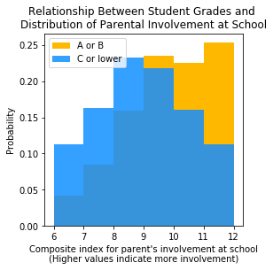
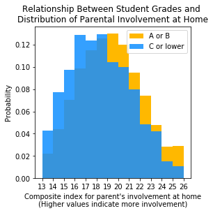

# Student Performance and Parental Engagement

[In an earlier study](https://github.com/anilca-lab/FIS-Mod3-Project), Steven Dye and I ran a series of hypothesis tests to examine if student performance was correlated with the intensity of parental engagement. Using data from the Parent and Family Involvement in Education Survey (2016), we found that higher parental engagement was related with better grades.

 

Using this exploratory analysis as the springboard, the study contained in this repo controls for the confounding variables that might be correlated with both parental engagement and student performance while benefiting from the rich dataset engineered from the same survey. The engineered features include -in addition to various dimensions of parental engegement- school, parent, and student characteristics. 

The study uses a logistic regression model on the SMOTEd data. Feature selection is based on variance inflation factors and Lasso regularization. The study funds parental engagement features to a statistically significant predictor of student performance. The study and findings are explained [here]().

Main files contained in this repo:

1. [Master_Notebook.ipynb](https://github.com/anilca-lab/parental-involvement-to-education/blob/master/Master_Notebook.ipynb): The Jupyter Notebook explaining the data, methodology, and analysis.
2. [pfi_pu.csv](https://github.com/anilca-lab/parental-involvement-to-education/blob/master/data/pfi_pu.csv): Survey data.
3. [cbook_pfi_pu.pdf](https://github.com/anilca-lab/parental-involvement-to-education/blob/master/data/cbook_pfi_pu.pdf): Codebook for the survey.
4. [X_train_upd.csv](https://github.com/anilca-lab/parental-involvement-to-education/blob/master/X_train_upd.csv): Features with variance inflation factors less than 5.
5. [data_prep.py](https://github.com/anilca-lab/parental-involvement-to-education/blob/master/data_prep.py): Functions for data preparation.
6. [training_test.py](https://github.com/anilca-lab/parental-involvement-to-education/blob/master/training_test.py): Functions for training and testing.
